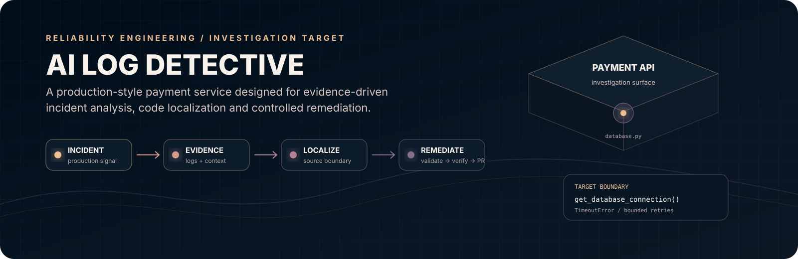

<div align="center">



<br>


</div>

---

# AI Log Detective

### A production-style incident investigation target for AegisAI

AI Log Detective is a deliberately structured **FastAPI payment service** designed to provide a realistic failure surface for the **AegisAI Reliability Engine**.

It gives an AI reliability workflow something concrete to investigate: a service, a dependency, an observable failure, application logs, source boundaries, and a reproducible path from incident evidence to code localization.

> **This repository is the system under investigation. AegisAI is the system doing the investigation and controlled remediation.**

---

## The System in One View

```text
┌─────────────────────────────────────────────────────────────────────┐
│                         PRODUCTION INCIDENT                         │
└──────────────────────────────────┬──────────────────────────────────┘
                                   │
                                   ▼
                         ┌─────────────────┐
                         │   LOG EVIDENCE  │
                         └────────┬────────┘
                                  │
                                  ▼
                         ┌─────────────────┐
                         │    DETECTION     │
                         └────────┬────────┘
                                  │
                                  ▼
                         ┌─────────────────┐
                         │   CORRELATION    │
                         └────────┬────────┘
                                  │
                                  ▼
                         ┌─────────────────┐
                         │      RCA         │
                         └────────┬────────┘
                                  │
                                  ▼
                 ┌────────────────────────────────┐
                 │       CODE LOCALIZATION        │
                 │  services/payment-api/app/     │
                 │          database.py            │
                 └────────────────┬───────────────┘
                                  │
                                  ▼
                         ┌─────────────────┐
                         │ REPAIR CANDIDATE │
                         └────────┬────────┘
                                  │
                                  ▼
                         ┌─────────────────┐
                         │ VALIDATE / VERIFY│
                         └────────┬────────┘
                                  │
                                  ▼
                         ┌─────────────────┐
                         │  GITHUB PULL     │
                         │    REQUEST       │
                         └────────┬────────┘
                                  │
                                  ▼
                           HUMAN REVIEW
```

The design goal is not autonomous production mutation. The goal is **evidence-backed investigation followed by controlled, reviewable remediation**.

---

## 01 — Why This Repository Exists

During a production incident, an error message is only the starting point.

An engineer needs to determine:

- what failed;
- which service or dependency is involved;
- which evidence belongs to the incident;
- where the failure reaches the application code;
- what source location should be inspected;
- whether a repair is appropriate;
- and whether a proposed change can be safely reviewed.

AI Log Detective creates that investigation surface in a compact service.

### Investigation chain

```text
Failure
  │
  ├── Service: payment-api
  │
  ├── Dependency: payments-primary
  │
  ├── Failure: database connection timeout
  │
  ├── Log: database timeout while processing payment
  │
  └── Source boundary:
          services/payment-api/app/database.py
                  │
                  └── get_database_connection()
```

---

## 02 — Architecture

```text
                         AegisAI
                Reliability Investigation Engine
                              │
                              │ investigates
                              ▼
                 ┌──────────────────────────┐
                 │     AI LOG DETECTIVE      │
                 │                          │
                 │      payment-api         │
                 └────────────┬─────────────┘
                              │
                ┌─────────────┴─────────────┐
                │                           │
                ▼                           ▼
        ┌───────────────┐           ┌────────────────┐
        │  payments.py  │           │  database.py   │
        │               │           │                │
        │ POST /payments│──────────▶│ connection     │
        │ error logging │           │ boundary       │
        └───────────────┘           └───────┬────────┘
                                            │
                                            ▼
                                     payments-primary
                                            │
                                            ▼
                                     timeout / failure
```

The separation matters. The application is intentionally independent from the AI investigation engine, allowing the reliability workflow to inspect a known target instead of being coupled to its own implementation.

---

## 03 — Failure Surface

The target service defines a primary database dependency:

```text
DATABASE_HOST   = payments-primary
DATABASE_REGION = ap-south-1
```

The dependency boundary lives at:

```text
services/payment-api/app/database.py
```

and is exposed through:

```text
get_database_connection()
```

The current failure path is intentionally bounded:

```text
get_database_connection()
       │
       ├── attempt 1
       │
       ├── attempt 2
       │
       └── attempt 3
              │
              ▼
        TimeoutError
```

The final timeout remains visible rather than being silently swallowed. This gives an investigation system a concrete failure signal and a clear source boundary.

---

## 04 — Request Flow

```text
POST /payments
      │
      ▼
process_payment()
      │
      ▼
get_database_connection()
      │
      ▼
payments-primary
      │
      ├──────── available ────────▶ continue payment
      │
      └──────── timeout ──────────▶ log exception
                                      │
                                      ▼
                                   HTTP 503
```

The service also provides:

```text
GET /health
```

for service health verification.

---

## 05 — What AegisAI Can Investigate

| Investigation stage | Target in this repository |
|:---|:---|
| Incident | Payment-service failure |
| Evidence | Application timeout log |
| Dependency | `payments-primary` |
| Failure mode | Database connection timeout |
| Service | `payment-api` |
| Request boundary | `POST /payments` |
| Code boundary | `services/payment-api/app/database.py` |
| Function | `get_database_connection()` |
| Error response | HTTP `503` |
| Remediation boundary | Candidate change reviewed through AegisAI |

This is intentionally more specific than a generic "log analyzer" demo: the system has a **known service topology, dependency boundary, failure mode and source location**.

---

## 06 — Repository Structure

```text
ai-log-detective/
│
├── assets/
│   └── aegis-hero.svg             # Repository visual identity
│
├── services/
│   └── payment-api/
│       ├── app/
│       │   ├── __init__.py
│       │   ├── database.py        # Dependency + timeout boundary
│       │   ├── main.py            # FastAPI application
│       │   └── payments.py        # Payment flow + error handling
│       │
│       └── requirements.txt
│
├── .gitignore
└── README.md
```

### Source responsibilities

| File | Role |
|:---|:---|
| `main.py` | FastAPI application and `/health` endpoint |
| `payments.py` | Payment endpoint, database call and timeout handling |
| `database.py` | Database dependency boundary and bounded retry behavior |
| `requirements.txt` | Python service dependencies |

---

## 07 — Technology Surface

<div align="center">

| Layer | Technology |
|:---|:---|
| Runtime | **Python** |
| API | **FastAPI** |
| Async execution | **asyncio** |
| Logging | **Python logging** |
| Service style | **REST API** |
| Investigation consumer | **AegisAI Reliability Engine** |

</div>

---

## 08 — Example Incident

A payment request enters the service:

```text
POST /payments
```

The handler requests a connection to:

```text
payments-primary
```

The connection boundary encounters:

```text
Database connection timeout: payments-primary
```

The application logs the failure while processing the payment request and returns:

```text
503 Service Unavailable
Payment service temporarily unavailable
```

AegisAI can then reason over the relationship:

```text
HTTP 503
   │
   └── payment processing failure
            │
            └── database timeout
                    │
                    └── payments-primary
                            │
                            └── database.py
                                  │
                                  └── get_database_connection()
```

That is the core purpose of this repository: **make the path from symptom to source location explicit and testable.**

---

## 09 — Design Principles

### Observable

Failures remain visible in application behavior and logs.

### Bounded

The demonstrated connection path has an explicit retry limit rather than an unbounded loop.

### Traceable

The dependency, service, request handler and source boundary can be connected during investigation.

### Separated

The application being investigated is separate from the AI reliability engine performing the investigation.

### Reviewable

The broader AegisAI workflow treats remediation as a candidate that must pass validation and safety checks before reaching a GitHub pull request.

---

## 10 — Visual System

The repository now uses a restrained **dark reliability-engineering visual language** rather than a generic developer theme.

### Palette

| Token | Hex | Role |
|:---|:---:|:---|
| `MIDNIGHT` | `#010D19` | Infrastructure foundation |
| `SAND` | `#EDBE91` | Primary diagnostic signal |
| `ROSE` | `#D99B91` | Incident / evidence signal |
| `MAUVE` | `#B48195` | Investigation / localization |
| `VIOLET` | `#856E8D` | Remediation / system depth |

### Visual language

```text
Dark infrastructure
       +
Warm diagnostic signals
       +
Muted rose / mauve layers
       +
Monospace technical labels
       +
Thin architectural lines
       +
Controlled depth
       =
Reliability engineering identity
```

The palette is deliberately muted and technical. No decorative emoji system is used.

---

## 11 — Local Development

### Clone

```bash
git clone https://github.com/deekshitaa1/ai-log-detective.git
cd ai-log-detective
```

### Install

```bash
cd services/payment-api
pip install -r requirements.txt
```

### Run

```bash
uvicorn app.main:app --reload
```

### Endpoints

```text
GET  /health
POST /payments
```

The FastAPI development server also exposes its standard API documentation interface.

---

## 12 — Relationship to AegisAI

AI Log Detective is intentionally the **investigation target**, not the remediation engine.

The larger AegisAI workflow is:

```text
                         AI LOG DETECTIVE
                                │
                                ▼
                         Incident evidence
                                │
                                ▼
                             Detect
                                │
                                ▼
                            Correlate
                                │
                                ▼
                               RCA
                                │
                                ▼
                            Localize
                                │
                                ▼
                             Propose
                                │
                                ▼
                            Validate
                                │
                                ▼
                             Verify
                                │
                                ▼
                          GitHub PR
                                │
                                ▼
                          Human review
```

The final boundary is deliberately a **reviewable change**, not an uncontrolled production edit.

---

## 13 — Repository Identity

**Name:** AI Log Detective  
**Role:** Production incident investigation target  
**Domain:** Reliability Engineering / AI-assisted debugging  
**Primary service:** FastAPI payment API  
**Failure class:** Database connectivity timeout  
**Primary source boundary:** `services/payment-api/app/database.py`

---

## 14 — Engineering Intent

This repository is small by design.

It does not try to demonstrate complexity through hundreds of files. It provides a clean and reproducible failure surface so an AI reliability system can demonstrate something more important:

```text
Can the system move from

        production symptom
              ↓
          evidence
              ↓
        likely cause
              ↓
        source location
              ↓
       bounded repair
              ↓
      validated change

without losing traceability or control?
```

That is the engineering problem this repository exists to support.

---

## 15 — Repository

<div align="center">

[**View AI Log Detective on GitHub**](https://github.com/deekshitaa1/ai-log-detective)

<br><br>

<sub>Evidence first. Localization second. Remediation under control.</sub>

</div>

---

<div align="center">

`010D19` · `EDBE91` · `D99B91` · `B48195` · `856E8D`

**AI Log Detective**

<sub>Production-style investigation target for AegisAI Reliability Engineering.</sub>

</div>
